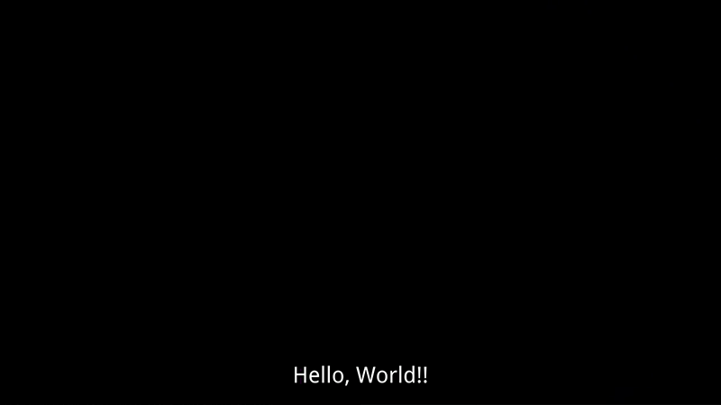
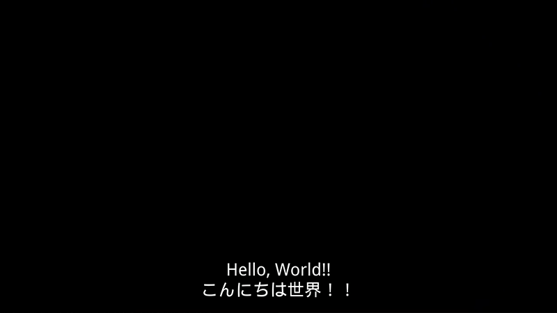

# Translate Subtitle

## Overview

Translate subtitle(.srt) to your native language. Generate single or dual displayed subtitle.  
Version: 1.1

Sometime struggling to understand MOOC contents even though with English subtitle.  
I always watch with English subtitle --> switch to my native language --> back to English subtitle again.  
It's bit cheat way but I think great method to understand each word relationship and boost my learning curve!  
Good for second language learner like me.

### Usage

- Set **target_path** and **input_lang**, **output_lang** language notation. Default: en(English) --> ja(Japanese)
- Check option **dual_subtitle**, **make_backup_folder**. (always keep original .srt file)
- Run. (checked on OS X Yosemite 10.10.5)

### Sample

   
Original  
  
Single  
  
Dual

### Notice

As original authors wrote, this is just experiment using selenium web driver.  
Please use moderately and if need many translations, it would be good to consider using Google Translate API.

### Reference

Reference by t2psyto/translate_srt.py  https://gist.github.com/t2psyto/18f7188415086f7e70c1

### License

This project is licensed under the MIT License.

### Authors

Yosuke Matsuno
